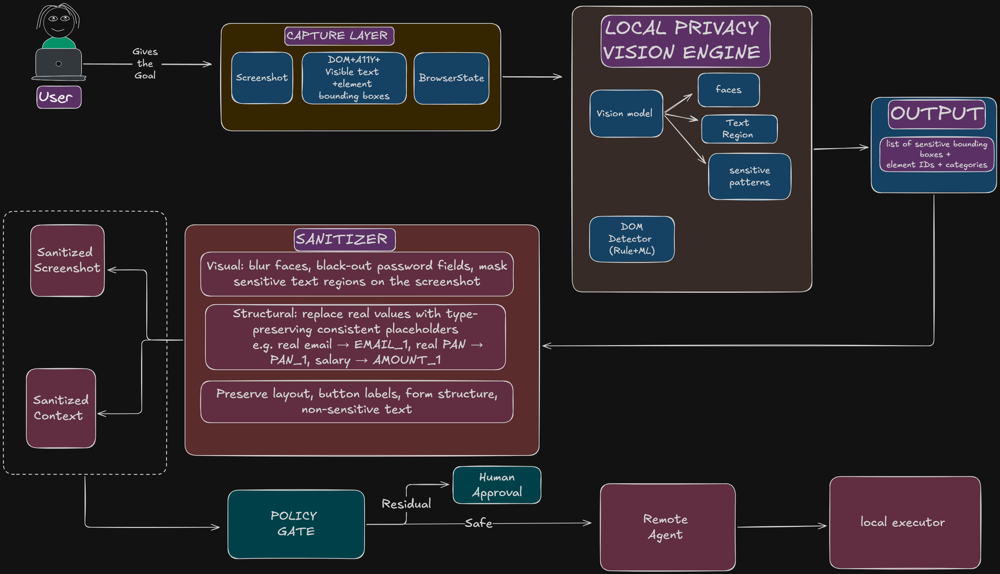

# PRIVIS

**PS ID:** SIH26171 — On-device Visual Perception for Light-weight Browser Agents
**Organization:** ISRO / Department of Space

PRIVIS is a browser extension that lets an AI agent operate a web page without ever seeing the user's raw personal data. A local Capture Layer takes an in-memory screenshot plus DOM state. The Local Privacy Vision Engine (DOM rules now, ONNX/WebGPU vision later) finds sensitive items. The Sanitizer redacts pixels and replaces strings with stable placeholders (`EMAIL_1`, `PAN_1`, `AADHAAR_1`, `AMOUNT_1`, `PHONE_1`, `NAME_1`). The Policy Gate allows, asks the human, or blocks. Only the sanitized view reaches the Remote Agent; its actions are executed locally by the Local Executor.

**One-liner:** local eyes, local eraser, remote brain.

## Architecture



## Flow

1. **Capture Layer** — background service worker screenshots the tab (memory only); content script reads DOM, a11y, visible text, element bounding boxes, and browser state.
2. **Local Privacy Vision Engine** — fuses DOM detections (now) with vision boxes (later); emits `{element_id, category, bbox, confidence, source}`.
3. **Sanitizer** — visual redaction on a canvas copy + type-preserving structural placeholders; layout, button labels, and non-sensitive text are preserved.
4. **Policy Gate** — Allow / Human Approval / Block on the sanitized package.
5. **Remote Agent** — receives only sanitized screenshot + sanitized JSON + goal; returns actions like `{ "type": "click", "target": "#submit" }`.
6. **Local Executor** — content script resolves targets and clicks/types on the real page, then loops back to Capture.

## Development

```bash
# 1. Install dependencies
npm install

# 2. Typecheck (no emit)
npm run typecheck

# 3. Build extension bundles to dist/
npm run build

# Or watch mode
npm run watch
```

### Load the extension in Chrome

1. Run `npm install && npm run build` (a fresh clone has no `dist/` yet).
2. Open `chrome://extensions`, enable **Developer mode**.
3. Click **Load unpacked** and select **this repository root** — `manifest.json` lives here and points at the compiled `dist/` output.

Notes:

- `dist/` is git-ignored by design; it is a build artifact, never committed. Load unpacked always targets the repo root, never `dist/` itself.
- `npm run typecheck` is `tsc --noEmit` and is the CI type gate; `npm run build` uses **esbuild**.
- esbuild bundles each entry as a classic (IIFE) script. Content scripts cannot be ES modules in Chrome MV3, so stripping the top-level `export`/`import` via bundling is what makes them load at all. Service worker and content scripts are all plain classic scripts — no `"type": "module"` needed.

## Testing the pipeline end-to-end

There is no hosted CI yet — the test pipeline is the two local gates below plus a manual E2E run in Chrome. Run the gates first; every change must pass both.

### 1. Local gates (automated)

```bash
npm install
npm run typecheck   # tsc --noEmit — TS type gate (the CI type gate)
npm run build       # esbuild → dist/ — bundle gate, must exit 0 and emit dist/
```

Both must exit 0. `typecheck` catches type drift; `build` catches import/bundle breakage in the MV3 entry points.

### 2. Manual E2E (Chrome)

1. **Load the extension**: open `chrome://extensions`, enable **Developer mode**, click **Load unpacked**, and select **this repository root** (`manifest.json`). The service worker should start with no errors.
2. **Serve the demo portal** (content scripts only run on http/https; `file://` won't match):
   ```bash
   cd demo-portal && python3 -m http.server 8000
   ```
   Open `http://localhost:8000`. All three content scripts (`dist/utils/dom-extractor.js`, `dist/privacy/sanitizer/structural-redact.js`, `dist/content/capture-content.js`) must inject cleanly — no errors in the page console.
3. **Trigger the manual capture hook** from the service worker console: `chrome://extensions` → **PRIVIS** → **service worker** link → DevTools console:
   ```js
   chrome.tabs.query({ active: true }, ([t]) =>
     chrome.runtime.sendMessage({ type: "PRIVIS_CAPTURE_SCREENSHOT", tabId: t.id }, (r) =>
       console.log(r?.dataUrl?.startsWith("data:image/png;base64,") ? "PASS: screenshot captured in-memory" : r))
   );
   ```
   The active tab must be the demo portal. **Pass** = a PNG `dataUrl` comes back and it is the portal page; the raw screenshot never touches disk or extension storage.
4. **When the full `runStep` pipeline is implemented**, run one complete step (Capture → Sanitizer → Policy Gate → Remote Agent → Executor) and diff the output against `fixtures/`: `detections.json` (vision-engine output), `sanitized-context.json` (sanitizer output — every sensitive value must be a placeholder like `EMAIL_1`/`PAN_1`), and `action-click-submit.json` (the remote agent's action that the executor must apply to `#submit`). The demo portal's fake PII is the stable target for this check.

## Contributing

1. **Fork** the repository to your GitHub account.
2. **Clone** your fork locally:
   ```bash
   git clone https://github.com/your-user-name/privis-hq.git
   cd privis-hq
   ```
3. **Create a branch** for your change:
   ```bash
   git checkout -b feature/your-feature-name
   ```
4. **Make your changes** and commit with a clear message:
   ```bash
   git commit -m "feat: brief description of change"
   ```
5. **Push** to your fork:
   ```bash
   git push origin feature/your-feature-name
   ```
6. **Open a Pull Request**: Navigate to the original repository on GitHub, click **Compare & pull request**, describe your changes, and submit.

## Research

Idea lock and research brief: [privis-idea-research](https://github.com/yb175/privis-idea-research).
