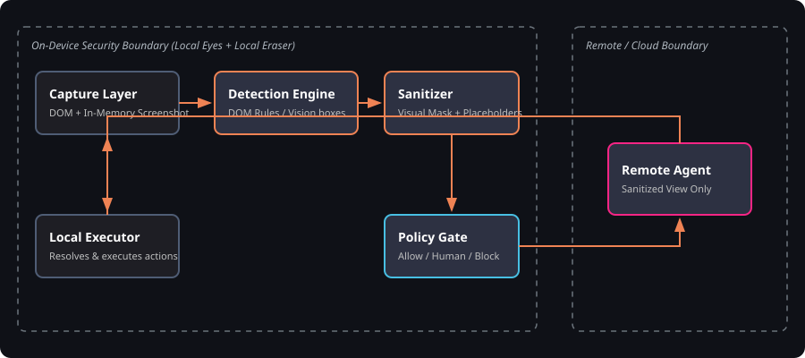

# PRIVIS

**PS ID:** SIH26171 — On-device Visual Perception for Light-weight Browser Agents
**Organization:** ISRO / Department of Space

PRIVIS is a browser extension that lets an AI agent operate a web page without ever seeing the user's raw personal data. A local Capture Layer takes an in-memory screenshot plus DOM state. The Local Privacy Vision Engine (DOM rules now, ONNX/WebGPU vision later) finds sensitive items. The Sanitizer redacts pixels and replaces strings with stable placeholders (`EMAIL_1`, `PAN_1`, `AADHAAR_1`, `AMOUNT_1`, `PHONE_1`, `NAME_1`). The Policy Gate allows, asks the human, or blocks. Only the sanitized view reaches the Remote Agent; its actions are executed locally by the Local Executor.

**One-liner:** local eyes, local eraser, remote brain.

## Architecture



## Flow

1. **Capture Layer** — background service worker screenshots the tab (memory only); content script reads DOM, a11y, visible text, element bounding boxes, and browser state.
2. **Local Privacy Vision Engine** — fuses DOM detections (now) with vision boxes (later); emits `{element_id, category, bbox, confidence, source}`.
3. **Sanitizer** — visual redaction on a canvas copy + type-preserving structural placeholders; layout, button labels, and non-sensitive text are preserved.
4. **Policy Gate** — Allow / Human Approval / Block on the sanitized package.
5. **Remote Agent** — receives only sanitized screenshot + sanitized JSON + goal; returns actions like `{ "type": "click", "target": "#submit" }`.
6. **Local Executor** — content script resolves targets and clicks/types on the real page, then loops back to Capture.

## Run (later)

```bash
# Load as unpacked MV3 extension in chrome://extensions (placeholder)
# Remote agent server: TBD
```

## Research

Idea lock and research brief: [privis-idea-research](https://github.com/yb175/privis-idea-research).
