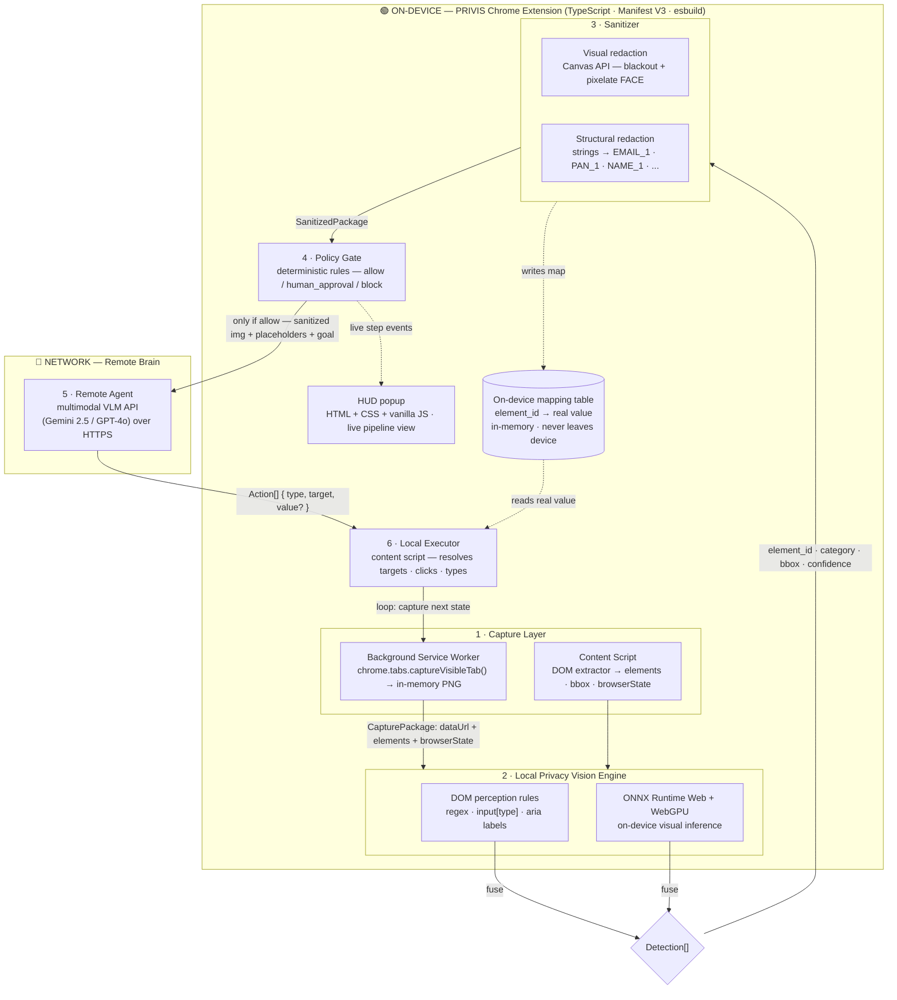

# PRIVIS — Architecture Block Diagram (with technologies)

## Block diagram

## Technology stack per module

| # | Module | Technology | What it does |
|---|--------|-----------|--------------|
| — | Language / build | **TypeScript**, **esbuild**, **Chrome Manifest V3** | Type-safe modules, IIFE-bundled content scripts & service worker |
| 1 | Capture Layer | `chrome.tabs.captureVisibleTab()` (background), content-script **DOM extractor** (`querySelectorAll`, `getBoundingClientRect`) | In-memory screenshot + element metadata with bounding boxes |
| 2 | Vision Engine (DOM) | **regex + `input[type]` + ARIA label rules** | Detect EMAIL, PAN, AADHAAR, AMOUNT, PHONE, NAME, PASSWORD, FACE with confidence |
| 2 | Vision Engine (ML) | **ONNX Runtime Web + WebGPU** | On-device visual inference — faces, cards, signatures (no data leaves device) |
| 3 | Sanitizer (pixels) | **Canvas API / OffscreenCanvas** | Black-out sensitive regions, pixelate FACE on a canvas copy |
| 3 | Sanitizer (text) | stable placeholder tokens (`EMAIL_1`, `PAN_1`…) | Swap real strings for stable placeholders; PASSWORD/FACE destroyed |
| 4 | Policy Gate | deterministic **TypeScript rules engine** | allow / human_approval / block — auditable, no ML |
| 5 | Remote Agent | **HTTPS fetch → VLM API** (Gemini/GPT-4o) | Receives ONLY sanitized screenshot + placeholders + goal; returns `Action[]` |
| 6 | Local Executor | **content script + `chrome.scripting`** | Resolve targets on real DOM, click/type real values from on-device map |
| — | Messaging | `chrome.runtime.sendMessage` / `chrome.tabs.sendMessage` | Typed, validated messages between worker ↔ content script ↔ HUD |
| — | HUD | **HTML + CSS + vanilla JS** popup | Live 6-step pipeline view with raw/sanitized screenshots + mapping table |
| — | Mapping table | in-memory `Record<element_id, value>` | Real values stay on-device; only placeholders cross the wire |

## Privacy invariant

> Raw PII, raw screenshots, and the mapping table never cross the device boundary.
> Only sanitized pixels + placeholders + goal leave; `Action[]` returns and runs locally.
