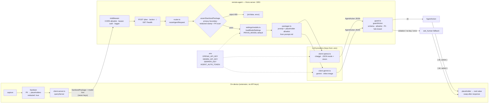

# PRIVIS Remote Agent

The remote "brain" of PRIVIS. Runs as a standalone Hono HTTP server, holds the
LLM API keys, and never sees raw PII — only the SanitizedPackage produced by the
on-device Sanitizer.

## Modules

| File | Role |
|------|------|
| `types.ts` | CBA-1 `AgentAction` contract, session types, PII pattern registry, `parseAgentAction` validator |
| `assert.ts` | Outbound privacy boundary (leaf module): `assertSanitizedPackage` — refuses raw capture fields, requires the `redacted: true` provenance stamp, PII-scans the serialized package. Enforced by `router.ts` **and** both provider clients at entry (Phase 01), so no path can dispatch an unsanitized package |
| `router.ts` | CBA-2 model router: routes to the configured provider, hallucinated-placeholder guard; re-exports `assertSanitizedPackage` |
| `packager.ts` | CBA-3 prompt packager: prompt formatting from sanitized context, last-step history, placeholder allowlist extraction. Loads the system prompt verbatim from `prompt.md` (single source of truth) |
| `guard.ts` | CBA-3 action guard: schema checks, one-action enforcement, placeholder allowlist validation, PII / URL scheme rejection, `ask_human` fallback |
| `prompt.md` | CBA-3 system prompt specification — **the runtime prompt itself**: loaded verbatim by `packager.ts` at build time (`--loader:.md=text`); editing it changes model behavior |
| `client-openai.ts` | "chatgpt" brain — OpenAI-compatible chat completions (vision + JSON mode) |
| `client-gemini.ts` | "gemini" brain — Google Gemini `generateContent` (inline image + JSON mode) |
| `client-server.ts` | Extension-side client: POSTs sanitized package to this server, no keys on device |
| `server.ts` | Standalone Hono HTTP server (`/plan`, `/health`) |

## Architecture



Data is sanitized before it leaves the device, validated twice on the server
(boundary on input, guard on output), and placeholders are only ever resolved
back to real values on-device — the server never sees raw PII and the device
never sees keys.

## Data flow

```
Extension (no keys)                     This server (holds keys)
────────────────────                    ──────────────────────────
capture → sanitize → gate               POST /plan:
  └─ queryServer() ──────────▶            1. assertSanitizedPackage (PII boundary check)
     { SanitizedPackage,                  2. packagePrompt (Packager builds prompt + allowlist)
       model: "chatgpt"|"gemini" }        3. routeAgentRequest → OpenAI / Gemini
  ◀───────────── { ok, action } ─────     4. guardModelOutput / guardAction (Guard lock)
                                             └─ ok: return AgentAction
                                             └─ fail: return ask_human
placeholder → real value swap
happens on-device, after response
```

## Running

```bash
npm run serve:agent          # build + start (default http://0.0.0.0:3201)
PORT=9000 npm run serve:agent
```

### Endpoints

| Method | Path | Body | Response |
|--------|------|------|----------|
| GET | `/health` | — | `{ status: "ok", service: "privis-remote-agent" }` |
| POST | `/plan` (`/action`, `/`) | `SanitizedPackage` + optional `model` preference | `{ ok: true, action: AgentAction }` or `{ ok: false, error }` (HTTP 400) |

## Configuration (`.env`)

Copy `.env.example` → `.env`. Keys live HERE, never in the extension.

```env
PRIVIS_MODEL=chatgpt        # default brain: "chatgpt" | "gemini"
OPENAI_API_KEY=sk-...       # required for chatgpt
# OPENAI_BASE_URL=https://api.openai.com/v1
# OPENAI_MODEL=gpt-4o-mini
GEMINI_API_KEY=AIza...      # required for gemini
# GEMINI_BASE_URL=https://generativelanguage.googleapis.com/v1beta
# GEMINI_MODEL=gemini-3.5-flash-lite-preview

# Destination discovery ('search' action): the server runs SerpAPI and answers
# with a navigate. Without a key the search action degrades to ask_human.
# SERPAPI_KEY=your_serpapi_key_here

# Security (recommended before exposing beyond localhost)
# AGENT_AUTH_TOKEN=change-me    # /plan then requires Authorization: Bearer <token>
# AGENT_ALLOWED_ORIGINS=chrome-extension://your-id,https://your-portal
#                               # default allowlist: localhost, 127.0.0.1, chrome-extension://
```

`.env` is loaded at server startup (`process.loadEnvFile`) — tests importing
the app stay hermetic and never see developer secrets.

## Behavior guarantees

- **Privacy boundary**: `assertSanitizedPackage` refuses packages with raw
  capture fields (`tabId`, `dataUrl`, `detections`), missing redaction
  provenance (`redacted: true` stamp from the Sanitizer path), empty fields, or
  any PII pattern in serialized context.
- **Same schema both ways**: chatgpt and gemini return the same validated
  `AgentAction` (CBA-1 contract).
- **No raw PII out**: `type` actions accept placeholder tokens only
  (`PAN_1`, `EMAIL_1`, ...); raw values and hallucinated tokens absent from the
  sanitized context are refused.
- **Fail-safe**: missing key → `ask_human` with `no_api_key`; provider errors →
  `ask_human` (agent loop never crashes on a remote failure).
- **Model preference**: the client's `model` field is a hint; the server always
  resolves it with its own keys and may fall back to `PRIVIS_MODEL`.

## Testing

```bash
npm run test:guard    # unit + production QA for Packager & Guard (#43)
npm run test:router   # unit + integration (mock fetch, no paid API calls)
npm test              # full suite: typecheck, CBA-1, CBA-2 router, CBA-3 guard, privacy
```

CI never calls paid APIs — all provider interactions are mocked `fetch`.

---

## Changelog

### CBA-3 — Packager + Guard (#43)

- **Packager** (`packager.ts`): Builds model prompt exclusively from sanitized context, extracts active placeholder allowlist, incorporates `lastStepResult` history, and strips sensitive metadata (`label`).
- **Prompt Spec** (`prompt.md`): Formalized system prompt instructions enforcing strict JSON-only outputs, placeholder usage rules, and action schema constraints.
- **Guard** (`guard.ts`): Pre-execution lock validating model output before Local Executor runs. Enforces single action per step, URL scheme allowlist (http/https only), placeholder allowlist membership, raw key bans (`value`, `text`, etc.), comprehensive PII rejection across all action properties, and graceful fail-closed fallback to `ask_human`.
- **Tests** (`tests/test-packager-guard.ts`): Complete unit and production QA test suite for Packager, Guard, protocol restrictions, placeholder allowlist, deep PII rejection, and fail-safe fallback flows.

### CBA-2 — Model router: chatgpt vs Gemini (#42)

- **Model router** (`router.ts`): user/operator picks the cloud brain; same
  `AgentAction` schema either way. Dispatch keyed on settings.model with
  shared defaults.
- **Provider clients**: `client-openai.ts` (OpenAI-compatible endpoint, JSON
  mode, markdown-fence tolerant via `parseAgentAction`) and `client-gemini.ts`
  (Gemini `generateContent`, inline base64 image, `responseMimeType:
  application/json`). Both share the system prompt and element-summary prompt
  builder.
- **Settings module** (`shared/settings.ts`): `ModelChoice =
  "chatgpt" | "gemini"`, persisted in `chrome.storage.local`
  (`privis_model_settings`), env fallbacks for Node/server, type-safe
  normalization (malformed stored values fall back to defaults instead of
  throwing).
- **Missing key handling**: no API key for the selected brain → `ask_human`
  with `no_api_key` reason (issue test-plan requirement).
- **Privacy hardening**:
  - Provenance gate — packages must carry the Sanitizer's `redacted: true`
    stamp; a regex scan cannot verify pixel redaction, so unmarked packages are
    refused.
  - Hallucinated-placeholder guard — model-returned `type` placeholders are
    verified against the sanitized context (rejects `PAN_2` when only `PAN_1`
    exists).
  - `label` omitted from prompts (sanitizer only swaps `text`; labels can carry
    raw page data) — matches the extension service-worker boundary.
- **Standalone server** (`server.ts`): Hono + `@hono/node-server`, CORS,
  `/health`, `/plan`. Rejects unsanitized packages with HTTP 400.
- **Key-safety architecture** (operator decision): LLM keys moved entirely
  server-side. Extension ships with zero keys; `client-server.ts` POSTs the
  sanitized package and the server resolves keys + brain. Client `model`
  preference is honored but resolved with server-held keys.
- **Executor bridge**: `agentActionToExecutorActions` in the service-worker
  converts `AgentAction` → executor `Action[]`, swapping placeholders to real
  values from the on-device map only (CONTRACT.md hard rule 2). navigate /
  scroll / done / ask_human are no-ops pending CBA-3 executor work.
- **Model default**: Gemini default set to `gemini-3.5-flash-lite-preview`
  (1.5 discontinued); single shared constant in `DEFAULT_MODEL_SETTINGS`.
- **Manifest**: added `storage` permission so settings persistence actually
  works in the extension.
- **Tests**: `tests/test-router.ts` — settings normalization/persistence,
  both provider clients (payload shape, error paths, PII-guard enforcement),
  sanitization boundary guards, end-to-end dispatch, Hono integration
  (`app.request`), server client round-trip with no-keys-on-wire assertion,
  model-preference resolution. All offline/mocked.
