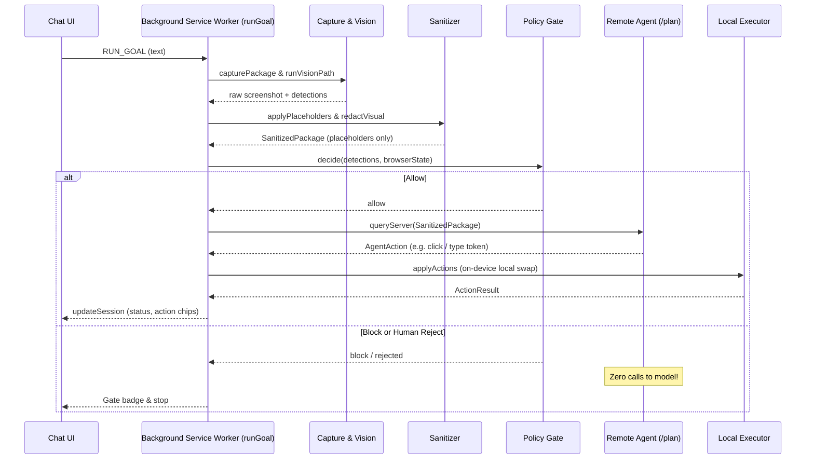

# PRIVIS QA Report — CBA-9 Wire Gate → Remote Agent → Executor in Background

- **Product box:** Goal Execution Entry Point (`orchestrator/runGoal.ts`, `background/service-worker.ts`, `extension/src/background/index.ts`, `extension/src/popup/Chat.ts`)
- **Scope:** issue #49 — enforce `runGoal(text)` as the single legal entry point in the background; wire `RUN_GOAL` message; strictly gate remote agent calls behind the Policy Gate; execute actions via Local Executor.
- **Reviewed branch:** `feat/cba-9-wire-gate-remote-agent-executor`
- **Evidence run:** `npm run typecheck`, `npm run build`, `npm test` (includes `test:goal` + all suites) — 100% passing.

## 1. What was attacked, and with what

| Attack / Test Vector | Vehicle | Result |
|---|---|---|
| Direct remote agent invocation bypassing Policy Gate | Audit callers & entry points | Caught. `runGoal` / `runStep` pipeline strictly evaluates Policy Gate before any `queryServer` call |
| Policy Gate BLOCK on sensitive bank/password portal | `RUN_GOAL` on bank login page with password field | Verified. Gate emits `block`, session marked `blocked`, and **0 calls** made to Remote Agent / model server |
| Chat UI sending `RUN_GOAL` on fake portal reaching Submit | `dispatchRuntimeMessage({ type: "RUN_GOAL", text: "Submit the employee portal form" })` | Verified. Navigates, types placeholders into name/email/pan, clicks `#submit`, receives `done`, settles on `/thanks` |
| Low-confidence / Human Approval rejection | Send `cba.humanDecision` with `approved: false` | Verified. Gate blocks, halts loop immediately, and makes **0 calls** to Remote Agent |
| Concurrent `runGoal` calls on the same tab | Trigger `runGoal` while loop is already executing on tab | Blocked. Returns `A session loop is already running on this tab.` without interleaving history |
| Empty / whitespace goal input | `runGoal("")` and `runGoal("   ")` | Caught. Rejects fast with `runGoal: Goal text must not be empty` before any capture or model call |
| Active tab auto-resolution | Call `runGoal(text)` without explicit `tabId` in Chrome environment | Verified. Queries `chrome.tabs` and targets active tab |
| Persistence & Network Leaks | Static regex scan across all background & orchestrator files | Clean. Zero `localStorage`, `chrome.storage`, or network fetch calls in background/orchestrator runtimes |

## 2. Testing Plan Execution (from Issue #49)

- **Chat goal on fake portal reaches Submit:**
  - Sent `RUN_GOAL` message from Chat component with text `Submit the employee portal form`.
  - Service worker invoked `runGoal`.
  - Multi-page loop transitioned `home` → `form` (typed local values for `NAME_1`, `EMAIL_1`, `PAN_1`) → clicked `Submit` → navigated to `thanks` → finished with status `done`.
  - Local executor executed `#submit` click on the real DOM.
- **Gate Block → zero calls to OpenAI/Gemini/Remote Agent:**
  - On a banking portal with password field (`https://secure-banking.internal.example/login`), Policy Gate triggered `block`.
  - Verified remote agent server recorded **exactly 0 calls** to `/plan`.
  - Zero actions executed on page DOM.
  - Chat and session status received `blocked` badge and reason.

## 3. Architecture & Data Flow Verification

## 4. Changes Summary

- `orchestrator/runGoal.ts`: Added single entry point `runGoal(text, tabId?)` resolving active tabs and routing strictly through `runStep`.
- `background/service-worker.ts`: Wired `msg.type === "RUN_GOAL"`, exposed `runGoal` on `privisAPI` debug global, and updated toolbar click listener.
- `extension/src/background/index.ts`: Added background barrel exporting `runGoal` and session utilities.
- `extension/src/popup/Chat.ts`: Wired `ChatComponent` to send `{ type: "RUN_GOAL", text: goal, tabId: this.tabId }`.
- `privacy/engine/vision/test-privacy-boundary.ts`: Added `orchestrator/runGoal.ts` and `extension/src/background/index.ts` to static persistence and network security audits.
- `tests/test-run-goal.ts`: New test suite (`npm run test:goal`) covering all CBA-9 validation, Gate zero-call blocks, Chat integration, and multi-page flows.
- `package.json`: Added `test:goal` and integrated it into `npm test`.
